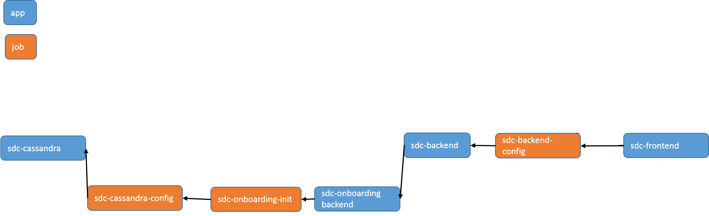
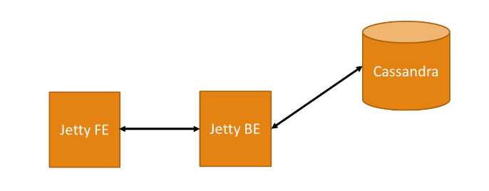

.. This work is licensed under a Creative Commons Attribution 4.0 International License.
.. http://creativecommons.org/licenses/by/4.0

============
Architecture
============

.. note::
   * This section is used to describe a software component from a high level
     view of capability, common usage scenarios, and interactions with other
     components required in the usage scenarios.  
   
   * The architecture section is typically: provided in a platform-component
     and sdk collections; and referenced from developer and user guides.
   
   * This note must be removed after content has been added.

SDC As Part of ONAP
===================

High Level Architecture
=======================

The following diagram shows the high-level relationship between the system components:

The SDC architecture uses the Jetty server as an application server.

- The *Jetty front end*:
   - supplies the static content of web pages, and all resources that required by the GUI
   - serves as a proxy for the REST API requests coming from the GUI
   
  Every request originating from the GUI is passed to the Jetty front-end server before it is executed.

- The *Jetty back end* containes all the logic for the SDC.

SDC uses two storage components: Elastic Search(ES) and Cassandra

- *Elastic Search* is used to index the auditing data received from different operations in the SDC.

  This information can then be analyzed with Kibana. The *Kibana server* enables statistical analysis of the operations done, according to the business logic.
  
- *Cassandra* is used to store auditing data, artifacts and data model objects.

Capabilities
============

Usage Scenarios
===============

Interactions
============
