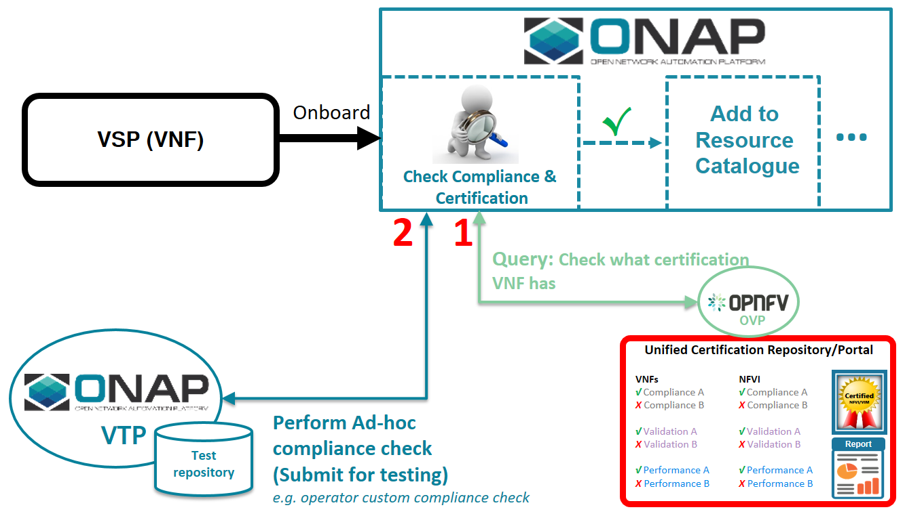

.. This work is licensed under a Creative Commons Attribution 4.0 International License.
.. http://creativecommons.org/licenses/by/4.0

=======================================================
Externalized Testing & VTP Certifications Query Feature
=======================================================

The Certifications Query and VTP (External to SDC) testing
feature was added to Dublin to allow SDC onboarding to reach
outside of SDC for testing of VSPs being onboarded.

These tests include queries for existing certification
results for prior versions of the VSP and testing of
CSAR or HEAT metadata via tests in or downstream of VTP.
The design includes the ability to configure (see configuration below)
multiple endpoints that SDC onboarding reaches out to for
external testing.

This diagram presents the architecture to be achieved in Dublin
or a future release given the resources available.

New and Impacted Code
=====================

The new code for this feature follows the software design
of the existing onboarding BE. New code is isolated into two
new subprojects contained within openecomp-be within minimal hooks
elsewhere.

*New code*:

Code that creates an HTTP endpoint exposed to the SDC-FE for this feature is contained
in this package:
  
  package: api/openecomp-sdc-rest-webapp/externaltesting-rest/externaltesting-rest-services
  
Code to hold data types for the VTP API and the implemation of the interface to VTP is contained
in these packages:

Provide the API and serialization classes for the REST API to VTP

  package: lib/openecomp-sdc-externaltesting-lib/openecomp-sdc-externaltesting-api
  
Implementation of the interface to VTP and Registry that are available for the HTTP endpoint above.

  package: lib/openecomp-sdc-externaltesting-lib/openecomp-sdc-externaltesting-impl

*Updated Code*:

To hook this new code into the web app, these additional changes were
made:

* api/openecomp-sdc-rest-webapp/pom.xml
  - Updated pom to include new module to build.
* api/openecomp-sdc-rest-webapp/onboarding-rest-war/pom.xml
  - Update pom to include externaltesting libraries.
* api/openecomp-sdc-rest-webapp/onboarding-rest-war
  - Update src/main/webapp/WEB-INF/beans-services.xml so that the external testing service beans are instantiated.

Configuration
=============

Configuration was added to the onboarding backend yaml in
order to know the URLs to reach VTP and external testing sources.
The full configuration is documented in the configuration section
of this manual. For details, see the BE-onboarding-configuration.yaml
section. Here is an example of the yaml.

::

    # External Testing Configuration
    externalTestingConfig:
      #array of endpoints that SDC-BE should connect with for external testing
      endpoints:
        // ID for endpoint
      - id: vtp
        // what format of post request does the endpoint accept for runs - json or multi-part form
        postStyle: application/json
        // is this enpoint enabled or disabled.
        enabled: false
        // base URL for the endpoint
        url: http://ec2-34-237-35-152.compute-1.amazonaws.com:9090
        // optional api key to pass in header to endpoint
        apiKey: blahblahblah
       - id: certifications repository
          postStyle: application/json
          url: http://ec2-34-237-35-152.compute-1.amazonaws.com:9090
          enabled: true
          apiKey: blahblahblah2

